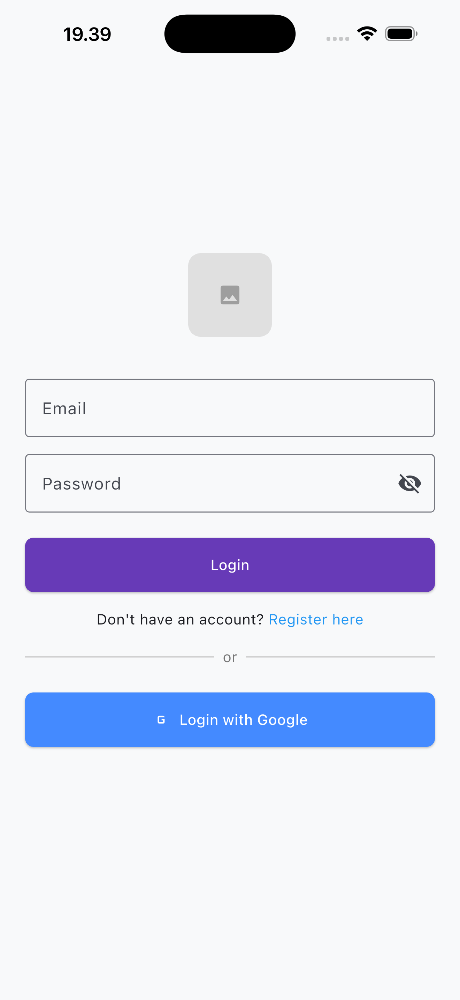
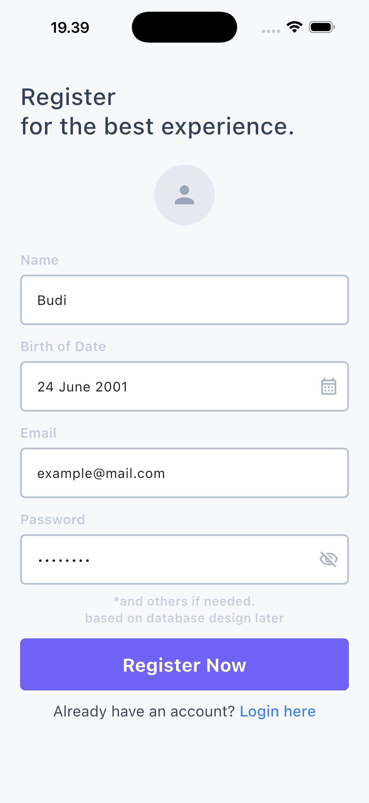
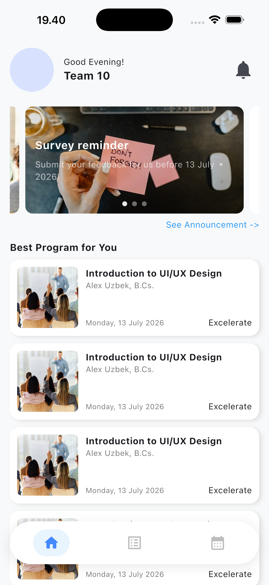
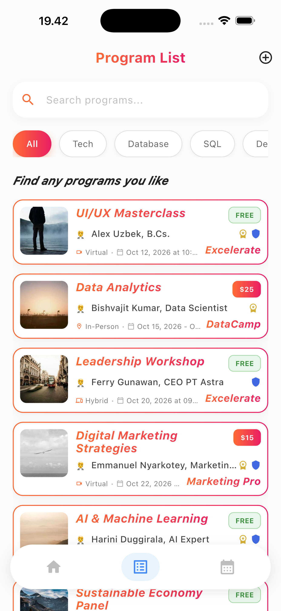
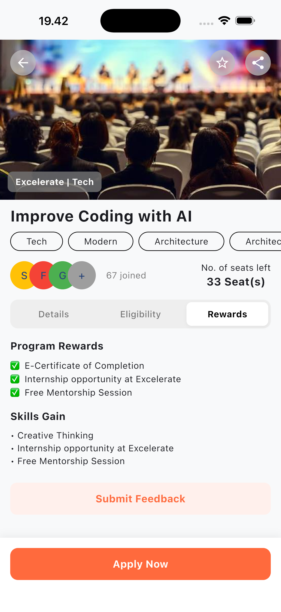
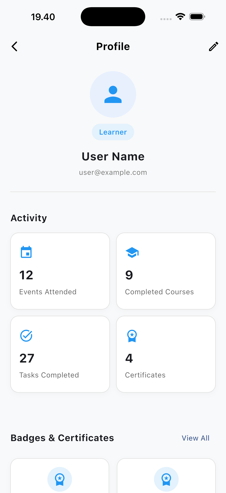
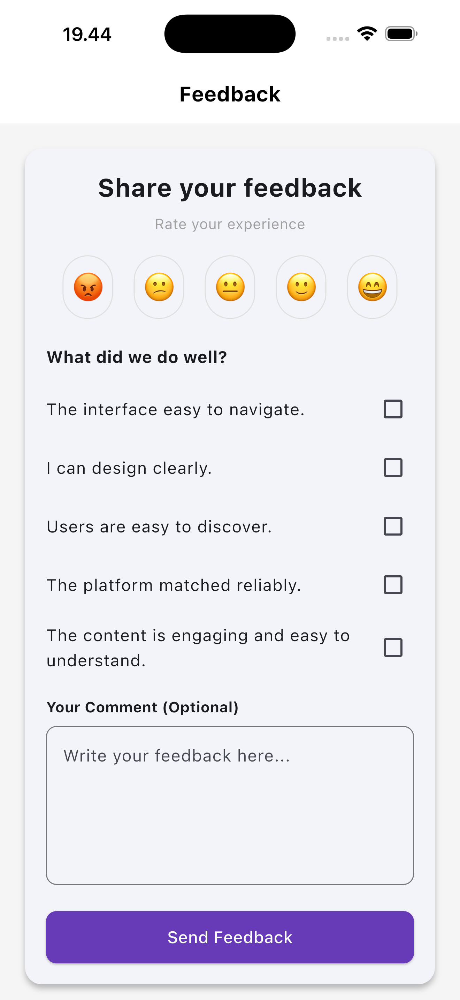
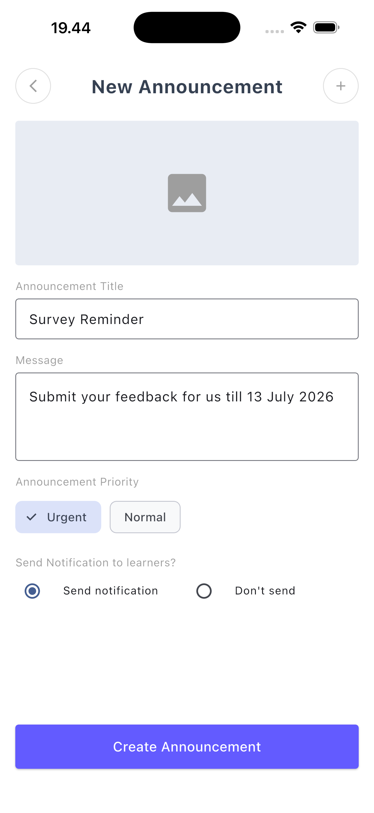
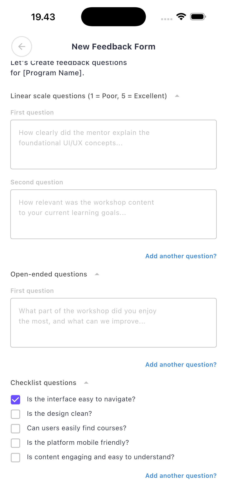

# Xlerate

**A Community Event Companion & Productivity Hub for Excelerate**

Xlerate bridges the gap between event discovery (workshops & programs) and personal learner organization (task tracking & calendar integration), while giving admins the tools they need to communicate with and understand their audience.

---

## Table of Contents

- [Vision](#vision)
- [Objectives](#objectives)
- [Who Uses Xlerate](#who-uses-xlerate)
- [Core Features](#core-features)
- [User Journeys](#user-journeys)
- [Navigation Flow](#navigation-flow)
- [Screens Overview](#screens-overview)
- [App Preview](#app-preview)
- [Tech Stack](#tech-stack)
- [Getting Started](#getting-started)
- [Project Status](#project-status)

---

## Vision

Excelerate's learners currently discover programs and workshops through disconnected channels, and manage their own schedules separately from the events they've committed to. On the other side, admins lack a single place to publish programs, broadcast updates, and understand how their audience is engaging.

Xlerate's vision is to become **the single hub** where Excelerate learners discover, register for, and organize their involvement in programs — and where admins can publish, communicate, and monitor engagement — all inside one connected experience.

## Objectives

- **Unify event discovery** — give learners a searchable, centralized catalog of all Excelerate programs and workshops.
- **Close the organization gap** — let learners turn program registrations into personal tasks, reminders, and calendar events automatically.
- **Enable direct communication** — give admins a simple way to post announcements and urgent updates that reach learners immediately.
- **Simplify program management** — let admins create, publish, and manage program listings without friction.
- **Provide visibility into engagement** — surface participation data and feedback so admins can act on it (e.g. reminding learners who haven't completed preparation).
- **Close the feedback loop** — collect learner feedback and survey data right after a program ends.

## Who Uses Xlerate

| Role | Description |
|---|---|
| **Learners** | Browse programs & workshops, register/join, track personal tasks and deadlines, view a combined (Excelerate + personal) calendar, submit feedback/surveys, and receive real-time alerts. |
| **Admins** | Post announcements (alerts/updates), create and publish program listings, view participants and track attendance/engagement, and review feedback/survey responses. |

## Core Features

### Learner Views
- **Splash Screen** — the first screen shown on app launch.
- **Home Dashboard** — greeting, feed of recent admin announcements, and a snippet of today's schedule.
- **Program Listing Screen** — searchable catalog of all programs/workshops.
- **Program Details Screen** — program description, date, time, and a "Register/Join Now" button.
- **Productivity Center** — a unified calendar page combining registered programs and personal tasks/reminders.
- **Feedback Form** — a clean ratings + text form shown after a program is completed.

**Nice-to-have:** push notifications for event/personal reminders synced to the system calendar, live Q&A, and quick polls during events.

### Admin Views
- **Admin Screen** — a quick-switch to the admin dashboard for managing programs, announcements, etc.
- **Announcement Tool** — a simple text form to instantly push updates to the learner's Home Screen.
- **Program Creator Form** — fields for workshop title, description, dates, and linked assets.
- **Data & Response Sheet** — a clean view of participant numbers and submitted feedback.

**Nice-to-have:** quick-copy participant emails for meeting invites, and global notifications to remind participants of new programs/updates.

## User Journeys

### Learner Journey
Budi wants to see upcoming events held by Excelerate. He opens the app, enters his credentials, and logs in.

**Scenario A:** After a successful login, Budi lands on the **Home Dashboard** and sees an announcement banner for an upcoming UI/UX Workshop. He clicks it and is taken directly to the **Program Detail Screen**.

**Scenario B:** After a successful login, Budi lands on the **Home Dashboard**, which greets him with a feed of recent announcements. Intrigued by the active listings, he taps **Browse Program**, which opens the **Program List Screen** — a searchable catalog of Excelerate workshops. He selects a program that interests him and is taken to the **Program Detail Screen**.

From there, the flow converges:

1. The **Program Detail Screen** shows the schedule and description. Budi taps **Register/Join**, which triggers a **Success Confirmation**. The program is automatically synced into his **Productivity Center / Calendar**.
2. Wanting to structure his day around the event, Budi taps **Add Task/Reminder**, opening the **Create Reminder/Task Screen**, where he adds a personal checkpoint that updates his calendar.
3. Once the program concludes, the system triggers the **Feedback Form Screen**. Budi rates and comments, submits, and is returned to the **Home Dashboard**.

### Admin Journey
The administrator logs in via the **Login Screen** and arrives at the **Home Dashboard**, tailored with administrative access.

1. **Sending an urgent update:** the admin opens the **Announcement Screen**, taps **Create Announcement**, fills out the form on the **Create Announcement Screen**, and submits — pushing a notification that updates the **Announcement Detail Popup** for active learners.
2. **Publishing a program:** from the main navigation, the admin opens the **Program List Screen** and taps **Add New Program**. They fill in the workshop title, description, and linked assets on the **Create Program Screen** and publish, triggering a **Success Confirmation** that pushes the program live to the directory.
3. **Monitoring engagement:** the admin taps a live program card to open its **Program Detail Screen**, then taps the **Participants** icon to reach the **Participants & Responses Screen**, reviewing feedback metrics. Seeing a subset of learners who haven't completed preparation, the admin taps **Send Reminder**, confirming a push notification broadcast before returning to the core details console.

## Navigation Flow

### Learner Flow

Login Screen
  → Home Dashboard
      → (Click Announcement Banner) → Announcement Detail Popup
      → (Click "Browse Program") → Program List Screen
      → (Click "Back") → Profile Screen
      → (Click Calendar) → Productivity Center / Calendar

Program List Screen
  → (Select Program) → Program Detail Screen
      → (Click Register/Join) → Success Confirmation
          → Auto-added to Productivity Center / Calendar
          → (After Program Ends) → Feedback Form Screen
              → (Submit Feedback) → Home Dashboard

Productivity Center / Calendar
  → (Click "Add Task/Reminder") → Create Reminder/Task Screen
      → (Submit) → back to Productivity Center / Calendar

### Admin Flow

Login Screen
  → Home Dashboard
      → (Click "Back") → Profile Screen
      → (Click Calendar/Announcement Alert) → Announcement Screen
      → Program List Screen

Announcement Screen
  → (Select Announcement) → Announcement Detail Popup
  → (Click "Create Announcement") → Create Announcement Screen
      → (Fill Form & Submit) → back to Announcement Screen

Program List Screen
  → (Click "Add New Program") → Create Program Screen
      → (Fill Details & Publish) → Success Confirmation → Program goes live
  → (Click "Participant" icon) → Program Detail Screen
      → (Click "Participants") → Participants & Responses Screen
          → (Click "Create Survey/Feedback Form") → Create Feedback/Response Form Screen
              → (Fill & Submit) → Success Confirmation
          → (Click "Send Reminder") → Success Confirmation

## Screens Overview

Based on the current wireframes, the following screens are designed or in progress:

| Screen | Purpose |
|---|---|
| Login Screen | User authentication |
| Register Screen | New user sign-up |
| Home Dashboard | Announcement feed + schedule snippet, role-aware (learner/admin) |
| Program List Screen | Searchable catalog of programs/workshops |
| Program Detail Screen | Program info, schedule, and Register/Join action |
| Create Program Screen | Admin form to publish a new program |
| Productivity Center / Calendar | Unified view of registered programs + personal tasks |
| Create Reminder/Task Screen | Add a personal task or reminder |
| Notification Screen | List of alerts and updates |
| Create Feedback Form Screen | Admin builds a survey/feedback form for a program |
| Submit Feedback Screen | Learner rates and comments after a program |

> Wireframes for these screens are maintained in Whimsical; see `/design` for exported references as they're finalized.

## App Preview

### Learner Experience
| Login Screen | Register Screen | Home Dashboard | Program List |
| :---: | :---: | :---: | :---: |
|  |  |  |  |
| Login | Register | Home Dashboard | Program List |

| Program Detail | Profile Screen | Submit Feedback |
| :---: | :---: | :---: |
|  |  |  |
| Program Detail | Profile | Feedback Form |

### Admin Management
| Create Announcement | Create Feedback Form |
| :---: | :---: |
|  |  |
| Create Announcement | Create Feedback |

## Tech Stack

- **Framework:** Flutter
- **Design:** Whimsical + Figma (wireframes → high-fidelity UI)
- *(Backend, state management, and calendar/notification integrations — TBD as development progresses)*

## Getting Started

```bash
# Clone the repository
git clone https://github.com/<your-username>/xlerate.git
cd xlerate

# Install dependencies
flutter pub get

# Run the app
flutter run
```

## Project Status

🚧 **In active design & development.**
Completed so far: app brief, user personas, learner & admin journeys, user flow diagrams, and initial low-fidelity navigation wireframes. Next up: high-fidelity UI, Flutter screen implementation, and backend integration.

---
